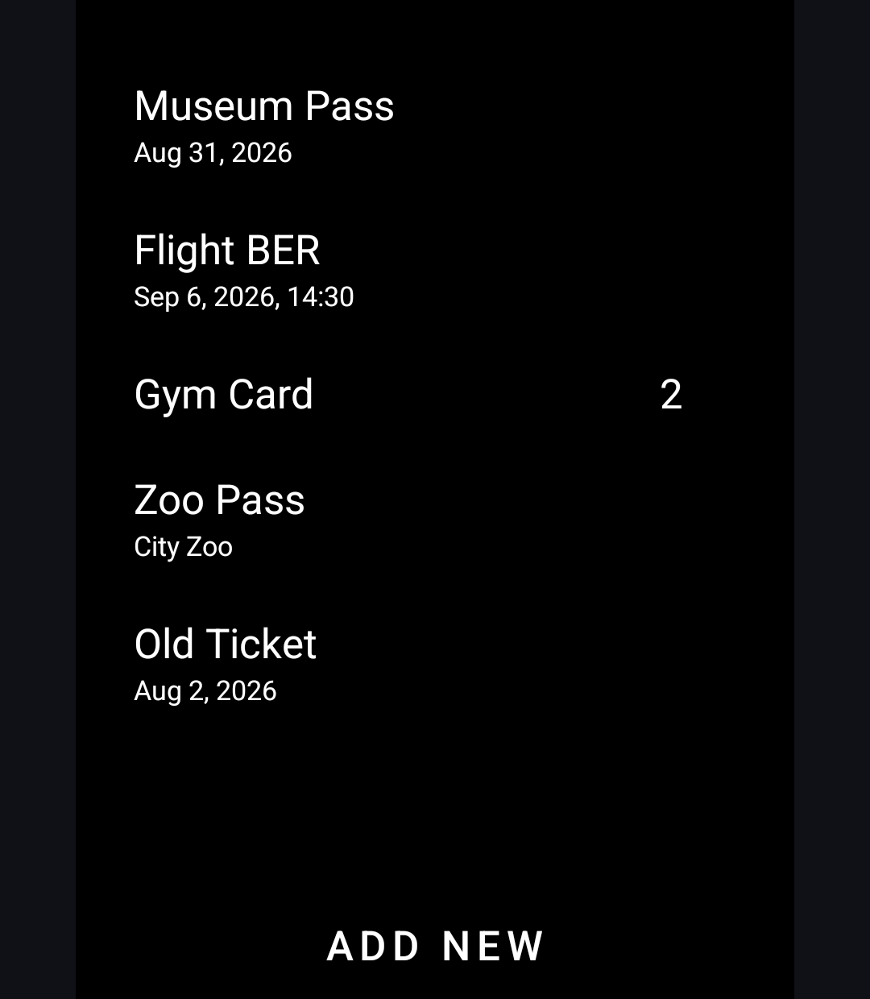
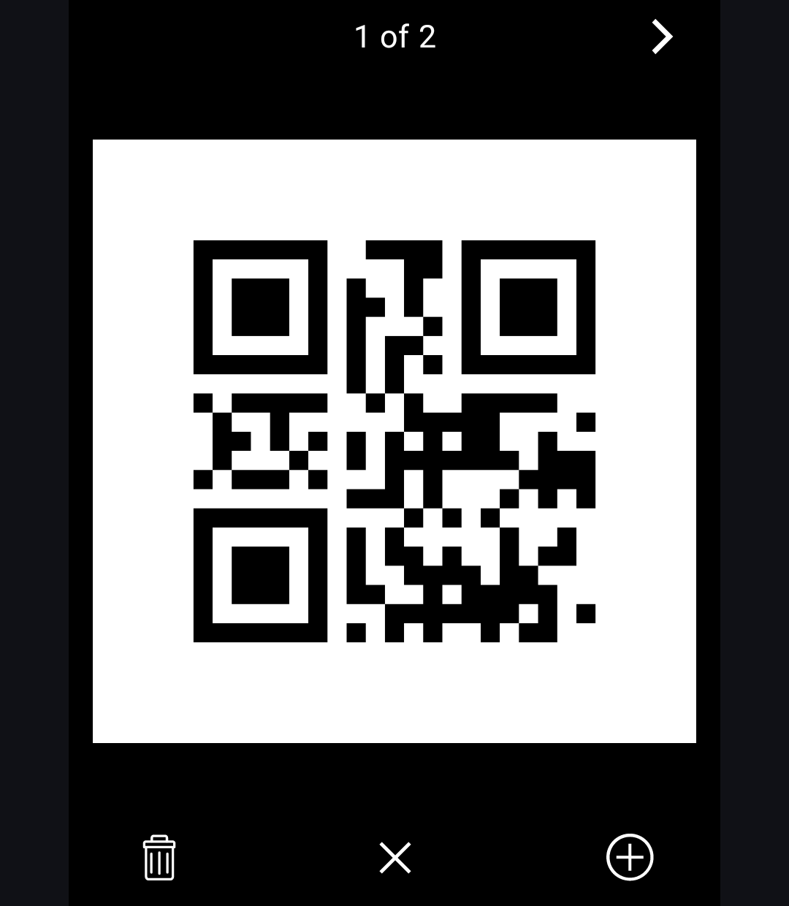
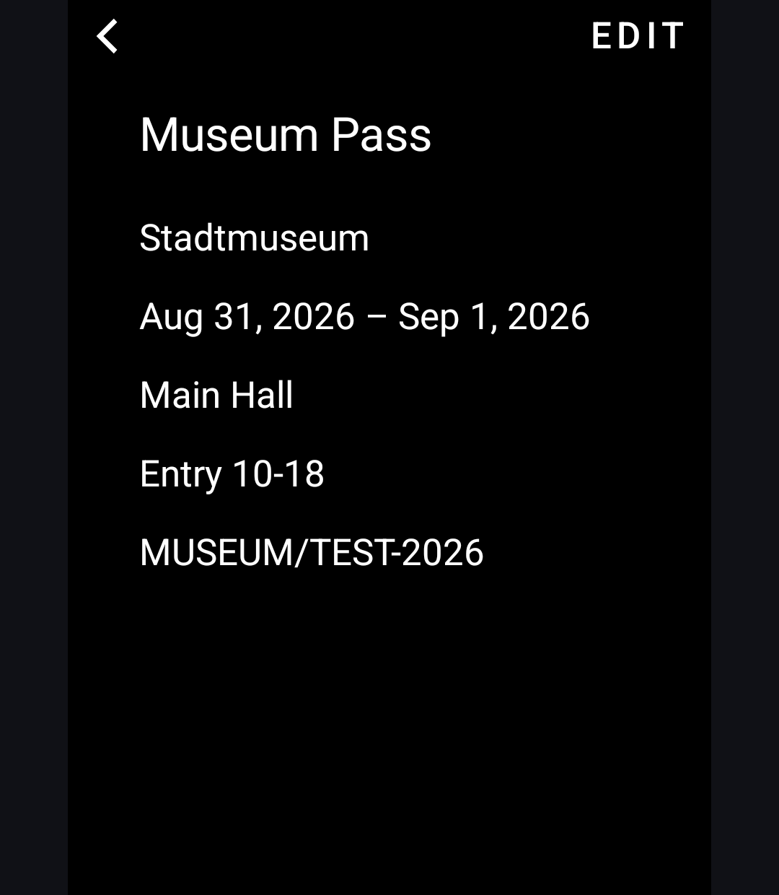
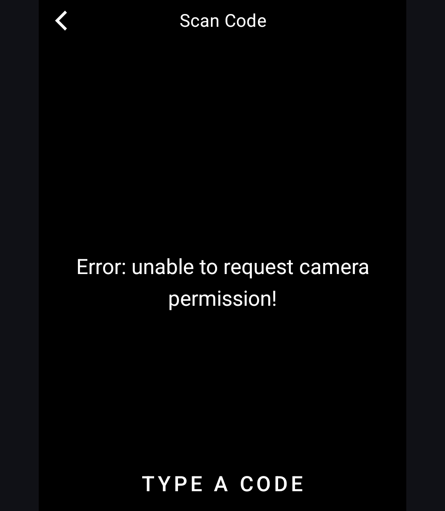

# Passes

An app for the Light Phone III to store and show codes — boarding passes,
library cards, memberships, anything a barcode or QR code represents.

Built as a **real LightOS tool** with the [light-phone/light-sdk](https://github.com/lightphone/light-sdk)
tool plugin: launched from the LightOS toolbox, UI on the Light design system.
Single-module since 2026-08-18 — storage and barcode rendering run in-process
in the tool; there is no companion APK. Modeled on the SDK's Authenticator
example.

Forked from [vandamd/passes](https://github.com/vandamd/passes) (MIT).

**Current release: 0.6.0** (2026-09-01) — captures and renders the exact
scanned symbol, so ticketing codes with non-standard error correction scan at
the gate 1:1; the code fullscreen is the pass's main view (delete moved out of
edit, delete confirmation reworked); date-aware home ordering.

## Features

- Store a code by **scanning** it with the camera (QR, Aztec, PDF417,
  Data Matrix, Code 128, EAN/UPC) or by **typing** it on the LP3 keyboard
  (typed codes are stored as QR). The scanner captures the **exact symbol
  grid**, so a code is rendered back as the identical symbol — never
  re-encoded from the payload (an airline Aztec with 32% error correction
  that a re-encode can't match scans at the gate byte-for-byte).
- **Stack codes** under one name — the `+` on the fullscreen adds another
  code to the pass from any code in the stack (at most 10); the top bar's
  "x of n" title with `<` / `>`, or a swipe, moves between them.
- Home opens a pass's code **full-screen on a 1:1 white card**, ready to
  scan. The bottom bar is **DELETE (trash) · X · `+`**: X dismisses to the
  list, `+` stacks another code, DELETE asks first — a stacked pass offers
  removing just the code you're viewing or the whole pass.
- **Tapping the code opens the details panel** — the shared details (issuer,
  date, end date, times, location, notes) as plain data — start date + start
  time on one line, end date + end time on the next — plus each stacked code's
  decoded payload. **EDIT** (top-right) renames or changes the details; the
  back arrow top-left dismisses without saving.
- Home lists passes date-aware: upcoming first (today before future), then
  no-date, then past.
- The code-entry keyboard is calm by design: no mic or emoji keys, capitalized
  start, larger input text.
- The renderer supports 13 barcode formats (QR Code, Aztec, EAN-13, EAN-8,
  PDF417, UPC-E, Data Matrix, Code 39, Code 93, ITF-14, Codabar, Code 128,
  UPC-A).

## Screenshots

| | |
|---|---|
|  |  |
|  |  |

## Build

Single-module Gradle project consuming the SDK as an included build:

```bash
source tools/env.sh
tools/build --dir passes :app:assembleDebug
```

APK (signed with the SDK dev keystore):

- Tool: `app/build/outputs/apk/debug/app-debug.apk` — `com.lightphone.passes`

Release builds (R8, ~14 MB):

```bash
tools/build --dir passes -Dorg.gradle.jvmargs="-Xmx5g -XX:MaxMetaspaceSize=768m" \
  -Dkotlin.daemon.jvmargs="-Xmx2g" :app:assembleRelease
```

## Install & run (emulator)

```bash
adb install -r app/build/outputs/apk/debug/app-debug.apk
# the tool's camera permission is granted at install; on the emulator:
adb shell pm grant com.lightphone.passes android.permission.CAMERA
adb shell am start -n com.lightphone.passes/com.thelightphone.sdk.LightActivity
```

The tool also appears in the LightOS toolbox. `lighttool.toml`'s
`serverPackage` is required by the plugin; the merged build has no companion,
so it points at the **platform's own SDK server** — `com.lightos` on a real
LP3 (which hosts the service LightOS uses for runtime permission requests,
verified 2026-08-18). When testing scanning on the emulator, flip it to
`com.thelightphone.sdk.emulator` (or pre-grant CAMERA with `pm grant`).

## License

MIT — see [LICENSE](LICENSE). Original work © Vandam Dinh.
